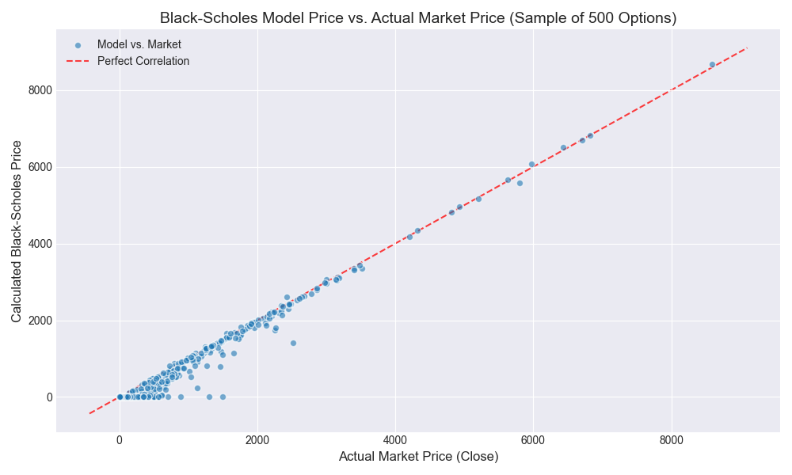

# Options Pricing Models and Their Accuracy

This repository hosts a project for FinSearch 2025 that analyses the accuracy of the Black-Scholes model for pricing NIFTY index options.

## Methodology

The project follows these steps:

1.  **Data Sourcing**: Historical options data for NIFTY Call Options (CE) from May 10, 2025, to August 10, 2025, was sourced from the National Stock Exchange (NSE).

2.  **Data Cleaning and Preparation**: The raw data is cleaned and prepared for analysis using the `data_cleaner.py` script. This involves:
    *   Standardising column names.
    *   Converting data types to numeric and datetime formats.
    *   Calculating the time to expiration for each option.
    *   Filtering out illiquid options and those with missing data.

3.  **Black-Scholes Model**: The `blackscholes_accuracy.py` script implements the Black-Scholes formula to calculate the theoretical price of the call options. It uses a 21-day rolling historical volatility as an input.

4.  **Accuracy Analysis**: The model's accuracy is assessed by comparing the calculated Black-Scholes price against the actual market closing price. The following metrics are calculated:
    *   Mean Absolute Percentage Error (MAPE)
    *   Root Mean Squared Error (RMSE)
    *   R-squared (R²)

## Results

The analysis provides insights into how well the Black-Scholes model performs on the NIFTY options dataset. The key results are printed by the `blackscholes_accuracy.py` script.

The following plot visualizes the correlation between the model's price and the actual market price for a sample of 500 options:

## Team

*   Megha Rao (24B1220)
*   Abhishek Upadhya (24B1309)
*   Sarthak Somani (24B3006)
*   Raheel Aggarwal (24B2478)
